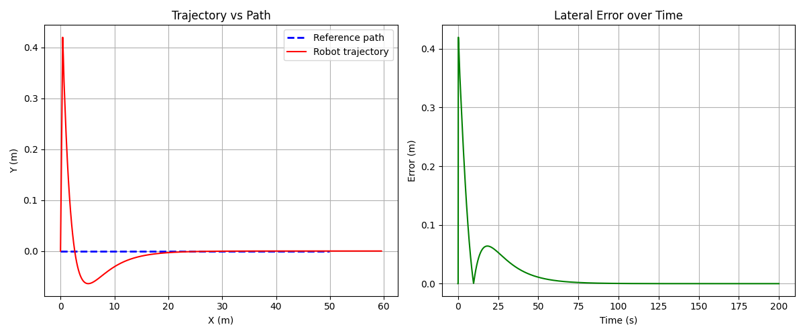
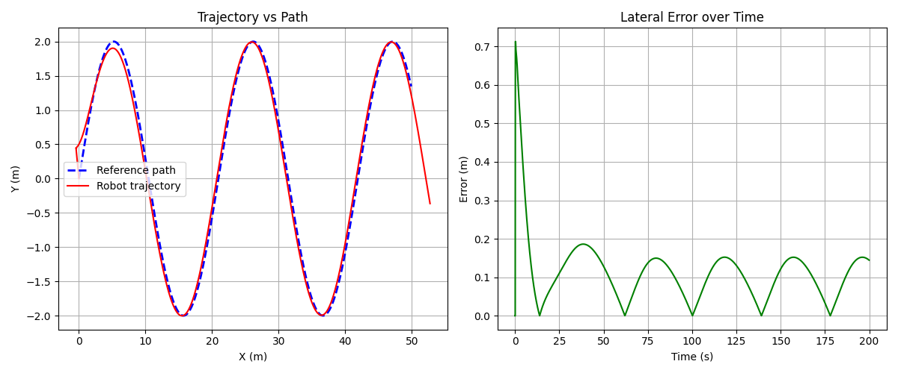
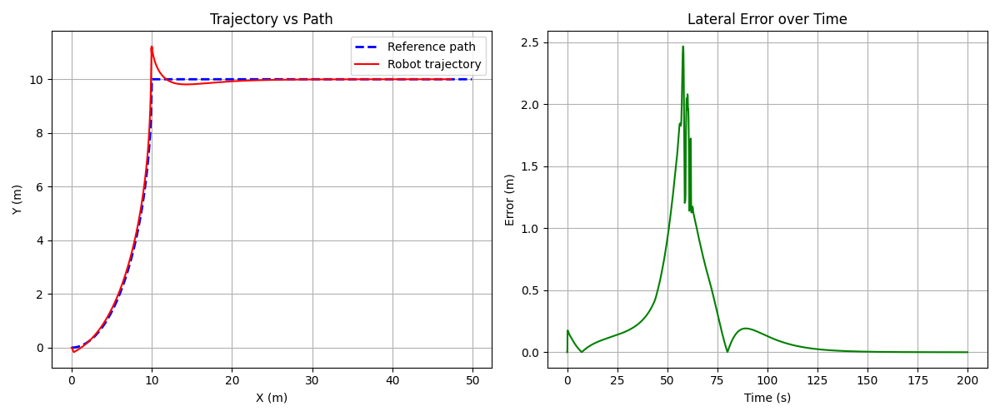
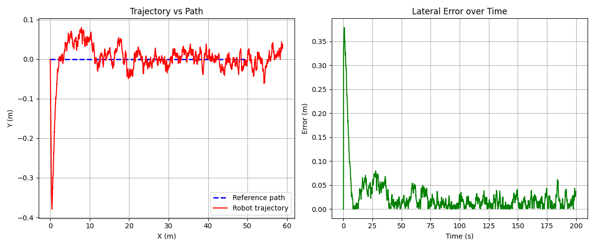
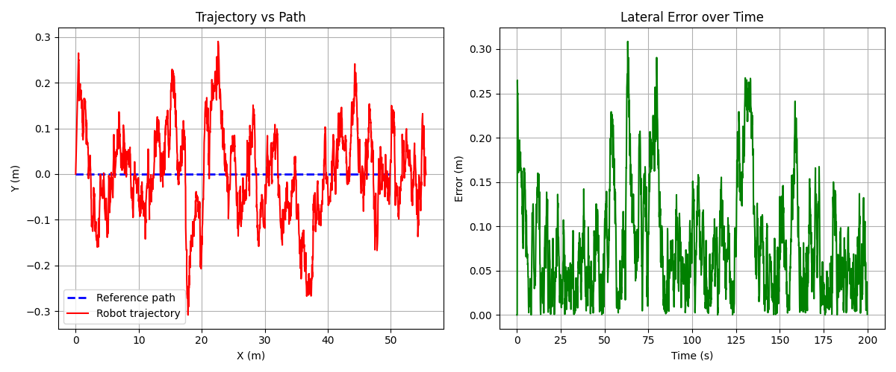
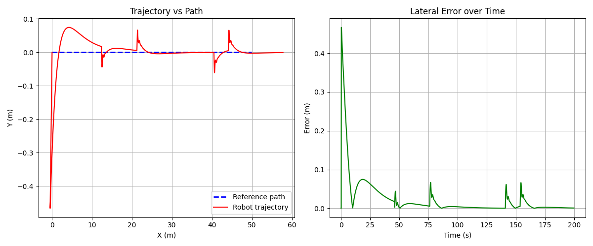
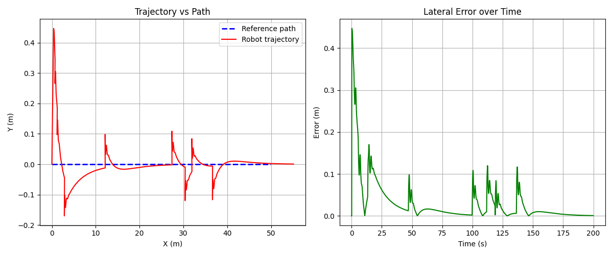
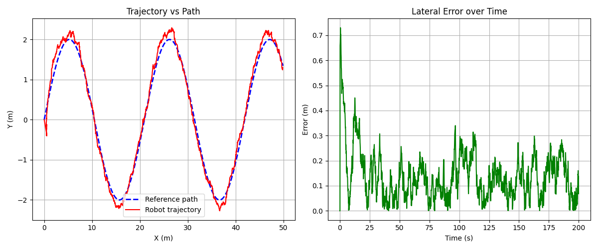
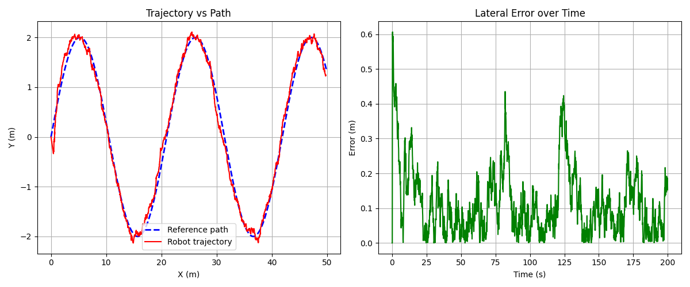

# Line-Following Robot — Digital Twin (Siemens Innexis VSI)

> Capstone project for the Digital Twin course using **Siemens Innexis Virtual System Interconnect (IVSI)**.  
> A differential-drive robot spawns near a predefined path on a 2D plane. A PID controller steers it onto the path and tracks it with minimal lateral error — all running as three Python clients communicating over the IVSI CAN backplane.

---

## 📐 System Architecture

```
┌─────────────────┐        CAN IDs 10,11,12         ┌─────────────────┐
│   Client 1      │ ──── x, y, theta ──────────────► │   Client 2      │
│   Simulator     │                                   │   Controller    │
│  (Plant Model)  │ ◄─── v, omega ─────── CAN 13,14 ─│   (PID Brain)   │
└─────────────────┘                                   └─────────────────┘
         │                                                     │
         │              CAN IDs 10, 11, 12                    │
         └─────────────────────────────────────────────────────┘
                                  │
                     ┌────────────▼────────────┐
                     │   IVSI CAN Backplane    │
                     │  (Virtual System Bus)   │
                     └────────────┬────────────┘
                                  │
                     ┌────────────▼────────────┐
                     │      Client 3           │
                     │   Visualizer / Logger   │
                     │  (Plots + KPIs)         │
                     └─────────────────────────┘
```

| Client | Role | Signals Published | Signals Received |
|--------|------|-------------------|-----------------|
| Simulator | Robot kinematics + noise/disturbance | x, y, theta | v, omega |
| Controller | PID + heading feedforward | v, omega | x, y, theta |
| Visualizer | Data logger + plot generator | — | x, y, theta |

---

## 📁 Repository Structure

```
lineFollower/
├── vsiBuildCommands          # IVSI digital twin configuration
├── Experiments/
│   ├── E1 Srcs/              # Gain sweep — straight path
│   ├── E2 Srcs/
│   │   ├── ArcCurve/         # Circular arc path
│   │   └── SinCurve/         # Sine wave path
│   ├── E3 Srcs/              # Noise & disturbance rejection
│   └── E4 Srcs/              # PD vs PID ablation
├── Plots/                    # All experiment result plots
├── Logs/                     # VSI simulation logs
├── src/                      # Active simulation source files
│   ├── simulator/simulator.py
│   ├── controller/controller.py
│   └── visualizer/visualizer.py
└── VSI Setups/               # Generated IVSI files
```

---

## 🧮 Robot Kinematics Model

The differential-drive robot follows these equations at each timestep `dt = 0.1s`:

```
x(t+1)     = x(t) + v · cos(θ) · dt
y(t+1)     = y(t) + v · sin(θ) · dt
θ(t+1)     = θ(t) + ω · dt
```

With optional Gaussian sensor noise:
```
x(t+1)     += noise_level · N(0,1) · dt
y(t+1)     += noise_level · N(0,1) · dt
```

And random angular disturbances:
```
θ(t+1)     += disturbance_mag · sign   (with probability 0.001 per step)
```

---

## 🧠 PID Controller Design

The controller computes lateral and heading errors, then applies a PID law:

```
lateral_error  = y_ref(x) − y
heading_error  = wrap_angle(θ_desired − θ)

ω = Kp · e_lat + Ki · ∫e_lat dt + Kd · (de_lat/dt) + Kp_head · e_heading + feedforward
v = 0.3 · max(0.3, 1 − |e_heading|)
```

**Best gains found (E1 Set 1):**

| Gain | Value |
|------|-------|
| Kp | 2.0 |
| Ki | 0.1 |
| Kd | 0.15 |
| Kp_head | 2.5 |

---

## 🔬 Experiments

### E1 — PID Gain Sweep (Straight Path)

5 gain sets tested with 3 random spawns each on a straight line `y = 0`.

| Set | Kp | Ki | Kd | Overshoot (avg) | Settling (avg) | SS Error (avg) |
|-----|----|----|-----|----------------|----------------|----------------|
| 1 (Best) | 2.0 | 0.1 | 0.15 | 0.363 m | 29.1 s | 0.000 m ⭐ |
| 2 | 1.5 | 0.05 | 0.10 | 0.299 m | 35.5 s | 0.000 m |
| 3 | 1.0 | 0.05 | 0.08 | 0.336 m | 47.6 s | 0.000 m |
| 4 | 0.5 | 0.02 | 0.05 | 0.274 m | 80.0 s | 0.000 m |
| 5 (Worst) | 0.2 | 0.0 | 0.01 | 0.271 m | 95.5 s | 0.003 m |

> **Key finding:** Higher Kp leads to faster settling. All sets achieved near-zero steady-state error on straight path.

**Sample E1 Plot:**



---

### E2 — Curved Path Robustness

Best gains (Set 1) applied to two curved paths:

**Circular Arc** — `y = r − √(r² − x²)`, radius `r = 10m`

**Sine Wave** — `y = 2·sin(0.3x)`

| Path | Overshoot (avg) | SS Error (avg) |
|------|----------------|----------------|
| Straight (E1) | 0.363 m | 0.000 m |
| Sine Curve | 0.415 m | 0.119 m |
| Circular Arc | — | — |

> **Key finding:** SS error increases on curved paths due to continuously changing heading reference. The robot still tracks both paths successfully.

**Sample E2 Plots:**





---

### E3 — Noise and Disturbance Rejection

| Condition | Noise Level | SS Error (avg) | Success Rate |
|-----------|-------------|----------------|-------------|
| No noise (E1) | 0.00 | 0.000 m | 3/3 = 100% |
| Low noise | 0.05 | 0.017 m | 3/3 = 100% |
| High noise | 0.20 | 0.054 m | 3/3 = 100% |
| Low disturbance | mag=0.5 | see plot | 100% |
| High disturbance | mag=2.0 | see plot | 100% |

> **Key finding:** Controller maintained robustness under all tested noise levels. SS error increases proportionally with noise magnitude. Disturbance spikes are clearly visible in plots but the robot always recovers.

**Sample E3 Plots:**









---

### E4 — PD vs PID Ablation

Curved sine path with noise (`noise_level=0.2`):

| Controller | Ki | Overshoot | SS Error |
|------------|-----|-----------|---------|
| PD (Ki=0) | 0.0 | 0.730 m | 0.127 m |
| PID | 0.1 | 0.606 m | **0.066 m** ⭐ |

> **Key finding:** The integral term (Ki) reduced steady-state error by **48%** on the curved noisy path. PD alone leaves a persistent bias that PID corrects through error accumulation.

**E4 Comparison Plots:**





---

## 🚀 How to Run

### Prerequisites
- Innexis VSI 2025.1 VPC
- Python 3.x
- matplotlib, numpy

### Setup

```bash
# Source VSI environment
source /opt/innexis/setup.sh

# Clone and navigate
cd ~/IVSI-LineFollower-DigitalTwin

# Build the digital twin
vsiBuild -f vsiBuildCommands

# Navigate to generated project
cd lineFollower

# Build and run
make build
vsiSim lineFollower.dt --hold
```

Then in the VSI simulation control window:
```
vsim> run
```

### Changing Experiment Configuration

**To change gains (E1 sweep):** Edit `src/controller/controller.py`:
```python
Kp = 2.0      # proportional gain
Ki = 0.1      # integral gain (set 0 for PD only — E4)
Kd = 0.15     # derivative gain
Kp_head = 2.5 # heading correction gain
```

**To change path (E2):** Edit `src/controller/controller.py`:
```python
# Straight path (E1)
y_ref = 0.0;  dy_dx = 0.0

# Sine curve (E2)
y_ref = 2.0 * math.sin(0.3 * x);  dy_dx = 2.0 * 0.3 * math.cos(0.3 * x)

# Circular arc (E2)
r = 10.0;  y_ref = r - math.sqrt(max(0, r**2 - x**2))
```

**To change noise (E3):** Edit `src/simulator/simulator.py`:
```python
noise_level = 0.0    # E1, E2 — no noise
noise_level = 0.05   # E3 — low noise
noise_level = 0.2    # E3 — high noise
disturbance_mag = 0.5  # E3 — low disturbance
disturbance_mag = 2.0  # E3 — high disturbance
```

---

## 📊 KPI Definitions

| KPI | Definition |
|-----|-----------|
| Overshoot | Maximum lateral error recorded during simulation |
| Settling Time | First time error drops and stays below 10% of overshoot |
| Steady-State Error | Average lateral error over last 10% of simulation time |
| Success Rate | Fraction of runs where SS Error < 0.1m |

---

## 🎬 Screencast Demo

<!-- Add your screencast video link or embed here -->

> **[📹 Click here to watch the simulation demo](#)**  
> *2-3 minute screencast showing the 3 VSI clients running, signals exchanging over the CAN backplane, and trajectory plots being generated.*

---

## 👤 Author

**Ammar Wahidi**  
Digital Twin Course — Siemens EDA  

---

## 📄 License

This project was developed as part of the Siemens Digital Twin training program.
